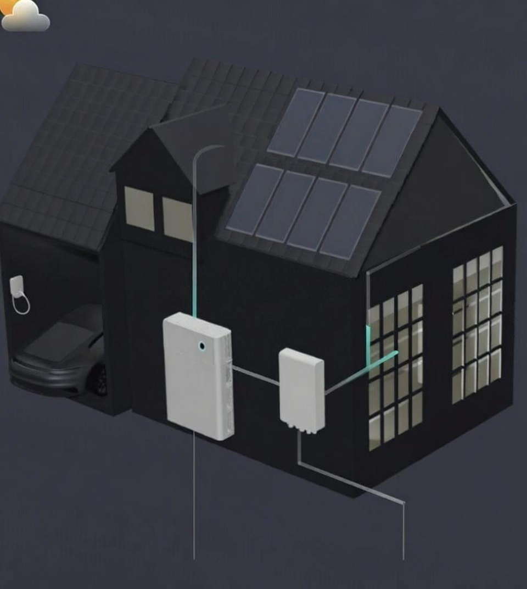

# Sigenstor House Monitor Card

Een geavanceerde Lovelace card voor Home Assistant die de complete Sigenstor-installatie visualiseert in een **3D-perspectief SVG-dashboard** met **live geanimeerde energiestromen** tussen huis, grid, batterij, PV en EV-lader.

De card vervangt statische PNG-afbeeldingen door volledig schaalbare, modulaire SVG-componenten. Hierdoor schaalt de UI perfect mee op mobiel, tablet én wall-panel schermen — zonder kwaliteitsverlies.

---

## 🌟 Kenmerken

- **3D / isometrische SVG-weergave** van:
  - Huis met zonnepanelen  
  - Sigenstor Battery + Inverter  
  - Sigen Gateway  
  - EV-charger  
  - Load / Home consumption  
- **Live geanimeerde energiestromen** (richting & intensiteit)  
- **Automatische detectie van import/export naar het grid**  
- **Ondersteuning voor laden/ontladen van de batterij**  
- **Optionele EV-lader ondersteuning**  
- **Modulaire UI** – toon alleen de apparaten die jij hebt  
- **Volledig schaalbare SVG’s (geen PNG’s meer)**  
- **Realtime overlays met waardes (W/kW/%)**  

---

## 📸 Screenshot



---

# 🧩 Installatie

## 🔹 Installeren via HACS (aanbevolen)

1. Open **HACS → Frontend → Custom repositories**
2. Voeg deze repository toe:

```yaml
https://github.com/Wolk9/lovelace-sigen-house-card
```
4. Kies **Lovelace** als categorie  
5. Installeer de **Sigenstor House Monitor Card**  
6. Voeg de resource toe (indien HACS dit niet automatisch doet):

```yaml
url: /hacsfiles/lovelace-sigen-house-card/sigen-house-card.js
type: module
```

🔹 Handmatige installatie
Download sigen-house-card.js

Plaats het bestand in:

```yaml
<config>/www/sigen-house-card/
```
Voeg handmatig toe aan Lovelace resources:

```yaml
url: /local/sigen-house-card/sigen-house-card.js
type: module
```
⚙️ Configuratie
Basisconfiguratie
```yaml
type: custom:sigen-house-card
title: Sigenstor
entities:
  pv_power: sensor.sigen_pv_power
  grid_import_power: sensor.sigen_grid_import
  grid_export_power: sensor.sigen_grid_export
  battery_power: sensor.sigen_battery_power
  battery_soc: sensor.sigen_battery_soc
  load_power: sensor.sigen_house_consumption
  ev_power: sensor.sigen_ev_power   # optioneel
devices:
  pv: true
  grid: true
  battery: true
  load: true
  ev: true
  gateway: true
  house: true
hide_missing: true
flow_threshold_w: 50
```
🧱 Modulair SVG-systeem

De UI bestaat uit afzonderlijke 3D-SVG componenten die je individueel kunt activeren of verbergen.


| Device key | Element             | Beschrijving   |
|------------|---------------------|----------------|
| pv         | Zonnepanelen op dak | PV-productie   |
| grid       | Elektriciteitspaal  | Import/export  |
| battery    | Sigenstor           | Laden/ontladen |
| load       | Verbruik            | Consumptie     |
| ev         | EV-charger          | Optioneel      |
| gateway    | Gateway box         | Optioneel      |
| house      | 3D huis             | Hoofdelement   |

Voorbeeld:

```yaml
devices:
  ev: false
  gateway: false
  battery: true
  pv: true
  house: true
```
⚡ Geanimeerde energiestromen
Elke stroomlijn:

* wordt actief bij energiestromen boven de drempel
* heeft richting afhankelijk van het teken van de waarde
* is idle bij lage of geen stroom
* is doorzichtig bij ruis (onder flow_threshold_w)

Richtingen
* Grid → Huis (import)
* Huis → Grid (export)
* Batterij → Huis (ontladen)
* Huis → Batterij (laden)
* PV → Huis
* Huis → EV (optioneel)

🔍 Entiteiten zoeken (Ninja-template)
Gebruikers kunnen hun Sigenstor entiteiten makkelijk exporteren:

1. Ga naar Ontwikkelhulpmiddelen → Sjablonen
2. Gebruik deze template:
```jinja

entity_id,device_class,unit

{{ s.entity_id }},{{ s.attributes.device_class|default('') }},"{{ s.attributes.unit_of_measurement|default('') }}"

```
3. Kopieer de lijst
4. Zoek de juiste waarden voor:
- PV
- Grid import/export
- Battery power
- Battery SOC
- Load (house consumption)
- EV power (optioneel)

🔧 Overzicht van configuratievelden

| Veld                       | Type    | Beschrijving                          |
|----------------------------|---------|---------------------------------------|
| ```entities.pv_power```         | sensor  | PV productie                          |
| ```entities.grid_import_power``` | sensor  | Import                                |
| ```entities.grid_export_power``` | sensor  | Export                                |
| ```entities.battery_power```     | sensor  | Positief = ontladen, negatief = laden |
| ```entities.battery_soc```       | sensor  | Accupercentage                        |
| ```entities.load_power```        | sensor  | Verbruik                              |
| ```entities.ev_power```          | sensor  | Optioneel                             |
| ```devices.*```                  | boolean | Toon/verberg onderdelen               |
| ```hide_missing```               | boolean | Onderdelen zonder entiteit verbergen  |
| ```flow_threshold_w```           | number  | Minimale waarde voor animatie         |

🔮 Roadmap
- Extra SVG-details en varianten
- Dynamische layout voor setups met meerdere batterijen
- Donker/licht thema automatisch
- Detailpopups per apparaat
- EV-session animatie

🤝 Bijdragen
PR’s zijn welkom, vooral voor:

- SVG-design verbeteringen
- Extra animatieopties
- Documentatie uitbreidingen

📄 Licentie
MIT License

🎉 Veel plezier met de Sigenstor House Monitor Card!
yaml
Code kopiëren

